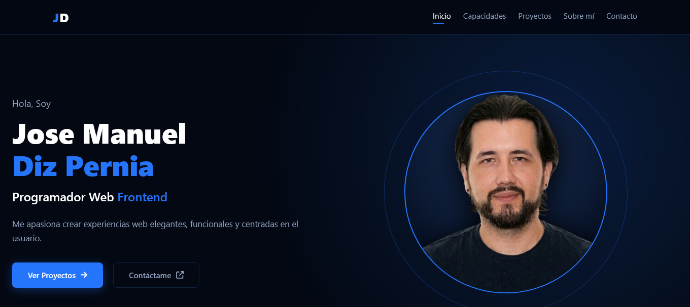
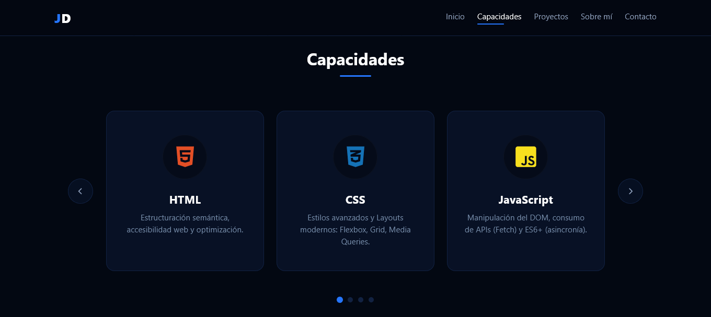
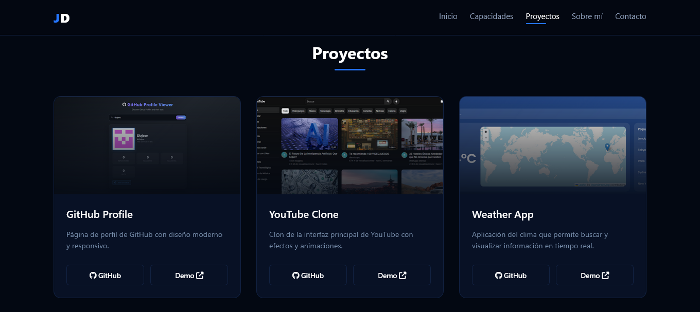
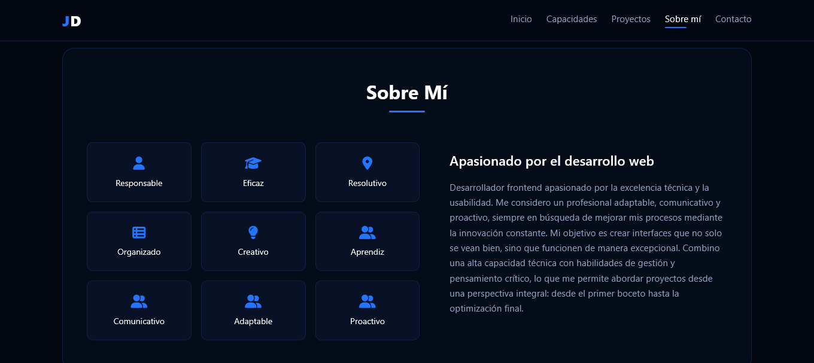
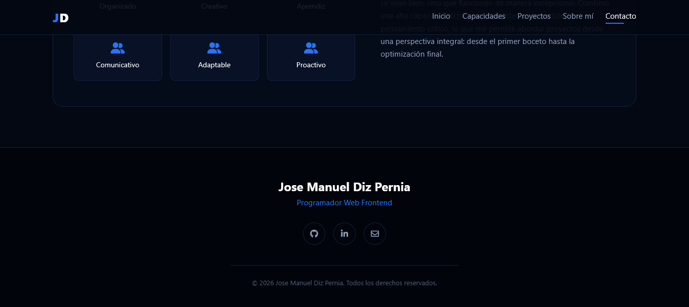

Portafolio Web - Jose Manuel Diz Pernia

Portafolio profesional personal, diseñado para mostrar mis habilidades como Desarrollador Web Frontend, mis proyectos destacados y mi trayectoria.

Este proyecto fue creado con el objetivo de consolidar mis conocimientos en desarrollo frontend, animación web, diseño responsive y organización modular de código.

---

Preview

### Portafolio — Inicio

### Portafolio — Capacidades

### Portafolio — Proyectos

### Portafolio — Sobre mi

### Portafolio — Contacto

---

Características

Presentación profesional de perfil de desarrollador

Secciones interactivas:

- Inicio con diseño llamativo
- Carrusel dinámico de tecnologías (Tech Stack)
- Galería de proyectos destacados
- Sobre mí y contacto

Navegación fluida:

- Menú hamburguesa responsive
- Scroll suave hacia secciones
- Detección de sección activa (Scroll Spy)
- Diseño responsive adaptable a móviles, tablets y escritorio
- Interfaz moderna con tema oscuro (Dark Mode) y efectos visuales de alta calidad
- Arquitectura modular
- Optimización de rendimiento

---

Arquitectura del Proyecto

El proyecto está organizado utilizando un enfoque modular:

- main.js → Punto de entrada, inicialización de componentes y lógica global
- navigation.js → Lógica del menú responsive y navegación (scroll spy)
- carousel.js → Funcionalidad del slider de tecnologías (autoplay, controles táctiles)
- style.css → Diseño, animaciones, Flexbox/Grid y estilos responsive

---

Cómo Funciona

main.js inicializa las clases TechCarousel y NavigationSpy al cargar el DOM.

navigation.js controla:

Apertura/cierre del menú móvil.

Resaltado automático de enlaces en la barra de navegación según el scroll.

carousel.js gestiona:

Desplazamiento automático de las tarjetas de tecnologías.

Controles manuales (botones y puntos de navegación).

Pausa al hacer hover con el ratón.

---

Diseño Responsive

La interfaz se adapta automáticamente a diferentes tamaños de pantalla:

Desktop: Layout optimizado para pantallas grandes con cuadrículas fluidas.
Mobile: Menú lateral tipo "off-canvas" optimizado para navegación táctil y diseño simplificado.
Componentes adaptables utilizando CSS moderno (Flexbox, Grid y Media Queries).

---

Tecnologías Utilizadas

- HTML5
- CSS3 (Variables, Flexbox, Grid, Animaciones)
- Vanilla JavaScript (Programación Orientada a Objetos)
- FontAwesome (Iconografía)
- Git & GitHub

Ejecutar el proyecto
Bash
git clone TU_URL_DEL_REPOSITORIO
cd portafolio

Después abre index.html o utiliza la extensión Live Server de VS Code.

---

Objetivo del Proyecto

Este proyecto fue desarrollado para practicar:

- Arquitectura modular en JavaScript (POO)
- Diseño de interfaces modernas y atractivas
- Optimización de navegación (Scroll Spy)
- Implementación de carruseles interactivos sin librerías externas
- Responsive Design avanzado
- Organización limpia de código fuente

////////////////////////////////////////////////////////////////////////////////////////////////////////////////////////////////////

Portfolio Web - Jose Manuel Diz Pernia

Professional personal portfolio, designed to showcase my skills as a Frontend Web Developer, featured projects, and professional background.

This project was created with the goal of consolidating my knowledge in frontend development, web animation, responsive design, and modular code organization.

---

Preview

---

Features

Professional developer profile presentation

Interactive sections:

- Striking Hero section
- Dynamic Technology carousel (Tech Stack)
- Featured projects gallery
- About me and contact information

Fluid navigation:

- Responsive hamburger menu
- Smooth scroll to sections
- Active section highlighting (Scroll Spy)
- Responsive design adaptable to mobile, tablet, and desktop
- Modern dark-themed interface with high-quality visual effects
- Modular architecture
- Performance optimization

---

Project Architecture

The project is organized using a modular approach:

- main.js → Entry point, initialization of components, and global logic
- navigation.js → Responsive menu logic and navigation (scroll spy)
- carousel.js → Technology slider functionality (autoplay, touch controls)
- style.css → Design, animations, Flexbox/Grid, and responsive styles

---

How It Works

main.js initializes the TechCarousel and NavigationSpy classes upon DOM load.

navigation.js controls:

Opening/closing the mobile menu.
Automatic highlighting of navigation links based on scroll position.

carousel.js manages:

Automatic sliding of technology cards.
Manual controls (buttons and navigation dots).
Autoplay pause on mouse hover.

---

Responsive Design

The interface automatically adapts to different screen sizes:

Desktop: Layout optimized for large screens with fluid grids.
Mobile: Off-canvas side menu optimized for touch navigation and simplified design.
Adaptive components using modern CSS (Flexbox, Grid, and Media Queries).

---

Technologies Used

- HTML5
- CSS3 (Variables, Flexbox, Grid, Animations)
- Vanilla JavaScript (Object-Oriented Programming)
- FontAwesome (Icons)
- Git & GitHub

---

Run the Project

Bash
git clone YOUR_REPOSITORY_URL
cd your-folder-name

Then open index.html or use the Live Server extension for VS Code.

---

Project Goal

This project was developed to practice:

- Modular JavaScript architecture (OOP)
- Modern and attractive interface design
- Navigation optimization (Scroll Spy)
- Implementing interactive carousels without external libraries
- Advanced Responsive Design
- Clean source code organization